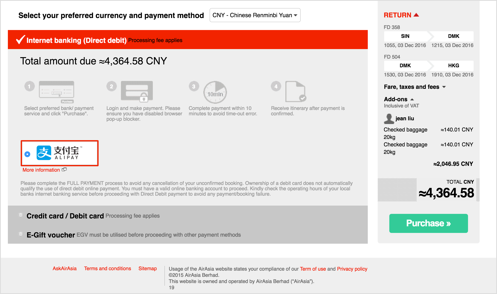
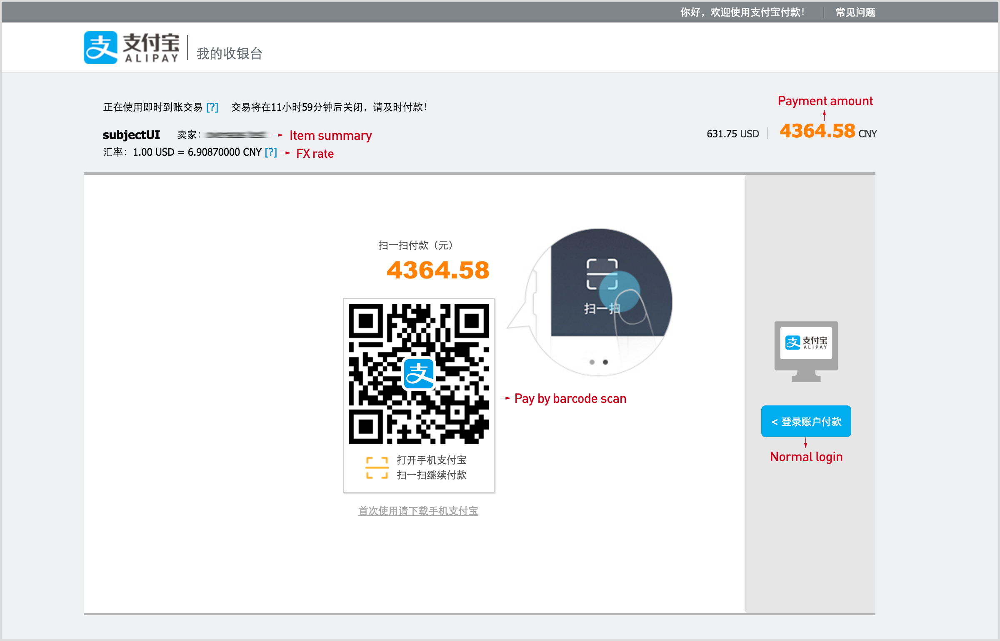
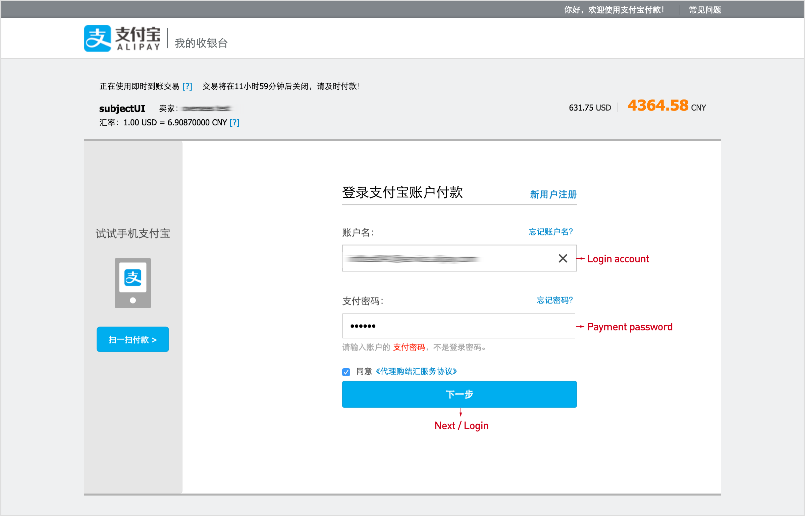
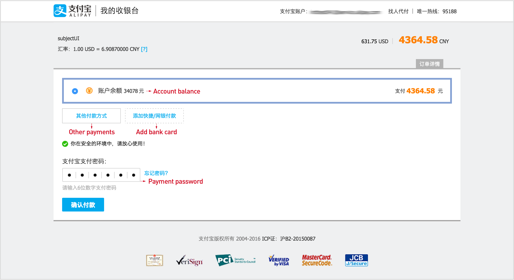
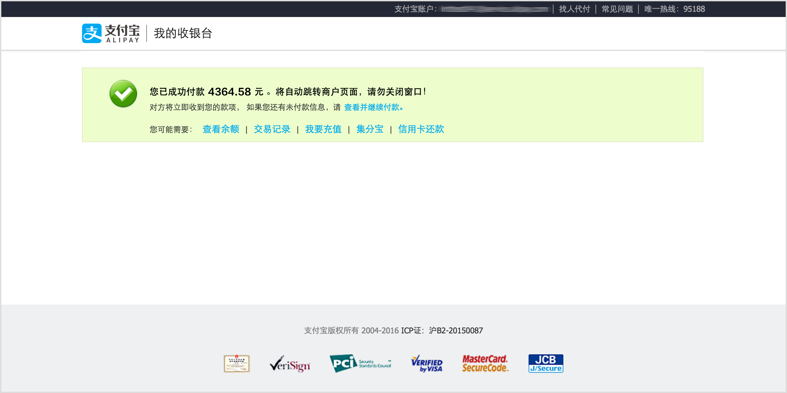

## Payment Flow and User Experience

#### Merchant checkout page:

    

#### Login page:

    

    

#### Payment page:

    

#### Success page (The user will be redirected back to merchant after this page):

    

