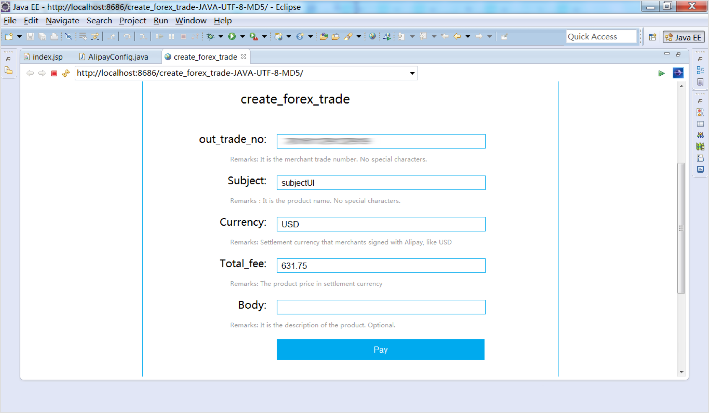
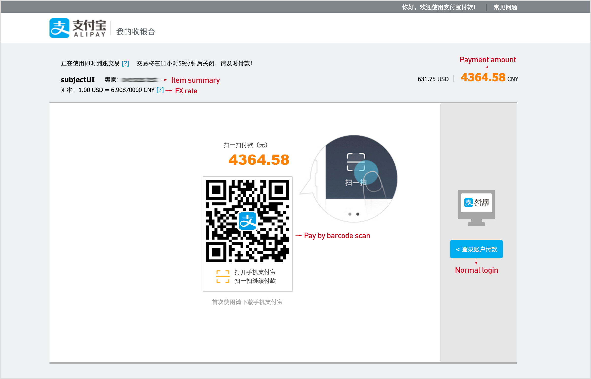
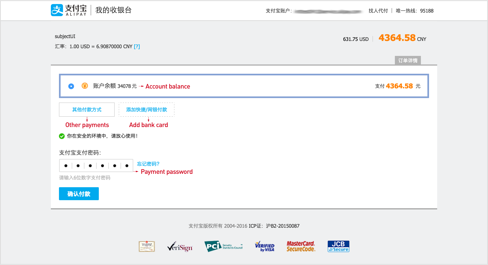
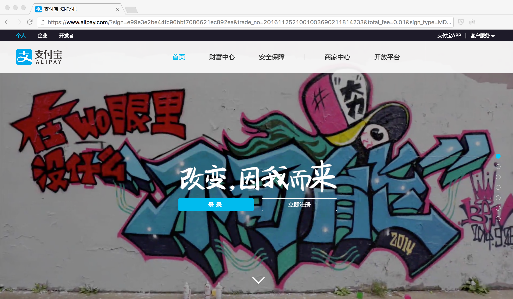

## Quick Integration

**Payment:** Merchants can reference the following alipay demo code to do quick integration or directly check the API document and construct the http request to make the payment. This section illustrates the steps needed for demo code approach.

 

#### Deploy/Run in Sandbox

Take JAVA demo code using MD5 signature algorithm as an example. Import the demo code project into your IDE tool, like Eclipse, then run:

    

Click payment button to pay:

    

Buyer can check the exchange rate here. Login to finish the payment:

    

Buyer is brought back to the merchant’s website after payment according to parameter return_url:

    

 

#### Integrate/Run in Production

Merchant can integrate the demo code into or write their own code and run in Alipay production. If using demo code, change the following two settings:

1. Change Alipay gateway to production URL:
https://mapi.alipay.com/gateway.do? in AlipaySubmit.java

2. Change the account and key information to the merchant’s real account in AlipayConfig.java. Merchants can check their account and key information in global.alipay.com.
