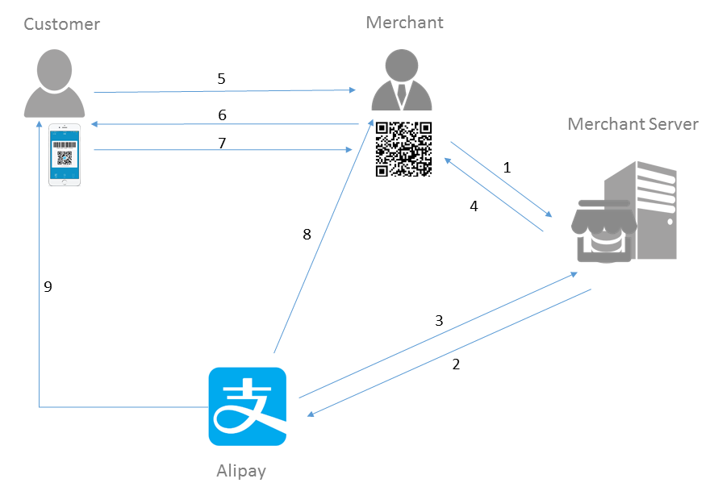

## The Payment Workflow

As the customer of the Merchant QR Code payment solution, you need first scan the QR code that is displaying in the merchant’s cashier counter. Subsequently, you need to input the amount and password respectively to complete the payment, as illustrated in Figure 1 (Note that the customer needs to be connected with the Internet).

    

1. The merchant requests for a merchant QR code;
2. The Alipay system receives the request and generate a merchant QR code;
3. The value and pic-url of the QR code is sent back to the merchant server in the API call response.
4. The merchant collect the QR Code and postup in the cashier counter;
5. A customer approaches the cashier for purchasing;
6. The merchant cashier shows the Merchant QR Code to the customer;
7. The customer scans the QR code, input the amount and confirm to pay;
8. The Alipay system sends a notification to the merchant’s server.
9. At same time, the Alipay system sends a notification to the customer.
